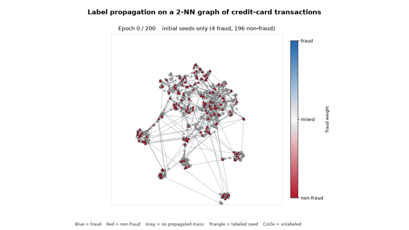

# Label propagation on three MNIST digits

Visual demo of the transductive step in [Label Propagation for Deep Semi-supervised Learning](https://arxiv.org/abs/1904.04717) (Iscen, Tolias, Avrithis, Chum, 2019).

<video src="https://github.com/OscarOvanger/Label_Prob_Visualization/raw/main/outputs/label_propagation.mp4" controls autoplay loop muted playsinline width="800"></video>

The same movie, as a GIF, for viewers that do not play the file above:



[Download the mp4](outputs/label_propagation.mp4) (200 frames at 10 fps, then the final comparison is held for 3 seconds).

Digit 0 is red, digit 1 is blue, and digit 2 is green. A soft label mixes those colors in proportion to the three class weights. Triangles are the 200 labeled seeds. Circles are unlabeled. Pale color means only a little mass has reached that point.

1. **Opening frame.** 2000 points, split across the three digits. Seeds are triangles. The other 1800 points are gray.
2. **Middle frames.** One frame per epoch. The 2-nearest-neighbor graph is drawn on a fixed UMAP of the images.
3. **Final frame.** Hard labels from `argmax` of the propagated weights, beside the ground truth for all 2000 points, including the labels that were held out.

## Algorithm

Descriptors are the 28×28 pixels scaled to [0, 1] and L2-normalized. For each point, the `k = 2` nearest neighbors get affinity `[cosine]_+^3`. That affinity is symmetrized and degree-normalized to `S`. One full Zhou step, the update cited in the paper, is

```
Z* = 0.99 S Z + 0.01 Y
```

`Y` is one-hot on the 200 seeds and zero elsewhere. Each epoch moves only a fraction α of the way toward that target, so the colors creep outward over all 200 frames:

```
Z ← (1 − α) Z + α Z*,    α = 0.05
```

A point is drawn in a full class color once its propagated mass reaches 0.08. Before that, the color is mixed with gray.

## Data

Images come from [`ylecun/mnist`](https://huggingface.co/datasets/ylecun/mnist). The subset is deterministic (`numpy` seed 0): 2,000 training images of digits 0, 1, and 2. Each point has one class. The last step is an `argmax`, so this is a three-class problem.

## Run

```bash
pip install -r requirements.txt
python main.py
```

The counts, graph, diffusion rate, step size, and colors are the block at the top of `main.py`. The first run downloads MNIST. `ffmpeg` encodes `outputs/label_propagation.mp4` and `outputs/label_propagation.gif`.
